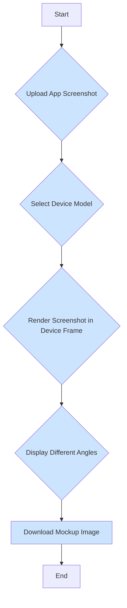

# Mocupp - High-Quality App Mockup Generator

Mocupp is a web application that allows you to create beautiful, high-resolution mockups of your mobile applications. Simply upload a screenshot of your app, choose a device frame, and Mocupp will generate professional-looking images from various angles, perfect for use on your website, in presentations, or for marketing materials.



## Core Features

*   Upload app screenshots (PNG, JPG).
*   Select from a library of popular mobile devices.
*   Render the screenshot within the selected device frame.
*   View the mockup in different orientations (Portrait and Landscape).
*   Clean and intuitive user interface.

## Tech Stack

*   **Frontend:** React, TypeScript
*   **Build Tool:** Vite
*   **Styling:** Tailwind CSS

## Getting Started

### Prerequisites

*   Node.js (>= 18.0.0)
*   npm, yarn, or pnpm

### Installation

1.  Clone the repository:
    ```bash
    git clone https://github.com/your-username/mocupp.git
    ```
2.  Navigate to the project directory:
    ```bash
    cd mocupp
    ```
3.  Install the dependencies:
    ```bash
    npm install
    ```

### Running the Development Server

To start the development server, run the following command:

```bash
npm run dev
```

Open [http://localhost:5173](http://localhost:5173) to view it in the browser.

## Project Structure

```
/
├── public/              # Static assets
├── src/
│   ├── components/      # Reusable React components
│   ├── data/            # Device specifications and other data
│   ├── types/           # TypeScript type definitions
│   ├── App.tsx          # Main application component
│   └── main.tsx         # Application entry point
├── package.json         # Project dependencies and scripts
└── README.md            # This file
```

## Future Roadmap & Potential Improvements

*   **Expanded Device Library:** Add more devices, including Android phones, tablets, and smartwatches.
*   **Advanced Customization:** Allow users to select different device colors and background options.
*   **Multiple Angles & 3D Views:** Introduce angled or perspective views of the devices for more dynamic shots.
*   **High-Resolution Export:** Add a "Download" button to save the final mockup as a high-resolution PNG.
*   **UI/UX Enhancements:** Implement drag-and-drop for file uploads and add a live preview that updates instantly.