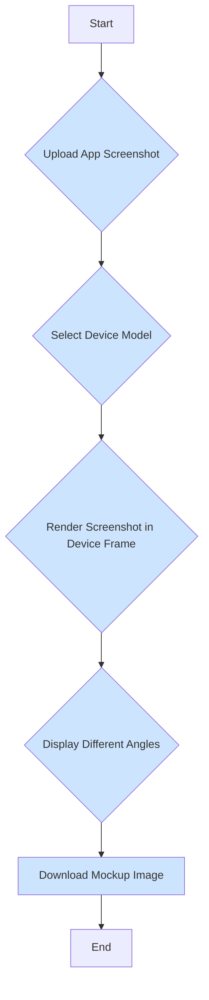

# Mocupp - Professional Device Mockup Generator

Mocupp is a sophisticated web application for creating high-fidelity device mockups of your mobile applications. With advanced features like image editing, multiple view angles, and enhanced project management, Mocupp helps developers and designers create professional marketing materials effortlessly.

## Features

### Core Features
* **Advanced Image Upload**
  - Drag-and-drop interface with multi-file support
  - Image format validation (PNG, JPG)
  - Built-in image editor powered by Fabric.js
  
* **Device Customization**
  - Comprehensive device model selection
  - Portrait and landscape orientation support
  - Multiple view angles with 3D perspective
  
* **Project Management**
  - Save and manage multiple mockup projects
  - Enhanced project organization
  - Batch processing capabilities
  
* **Advanced Rendering**
  - High-quality device frame rendering
  - Real-time preview updates
  - Multiple viewport support
  
* **Export Options**
  - High-resolution image export
  - Multiple format support
  - Customizable export settings

## Tech Stack

### Frontend
* **Core**: React 18.3 with TypeScript
* **Build System**: Vite 6.3
* **Styling**: 
  - Tailwind CSS 3.4
  - Class Variance Authority
  - Tailwind Merge
  - Tailwind Animate

### UI Components
* Radix UI (Select, Slider, Slot)
* React Dropzone
* React Zoom Pan Pinch
* Lucide React (Icons)

### Image Processing
* Fabric.js 5.3
* HTML-to-Image

## Project Structure

```
/
├── src/
│   ├── components/
│   │   ├── ui/              # Base UI components
│   │   ├── DeviceRenderer   # Device frame rendering
│   │   ├── DownloadModal    # Export functionality
│   │   ├── FabricImageEditor# Image editing capabilities
│   │   ├── ProjectManager   # Project state management
│   │   └── ...             # Other component modules
│   ├── data/               # Device specifications and constants
│   ├── lib/                # Utility functions and helpers
│   ├── types/              # TypeScript type definitions
│   ├── App.tsx            # Main application component
│   └── main.tsx           # Application entry point
├── public/                # Static assets
└── [Configuration Files]  # TypeScript, ESLint, Vite, etc.
```

## Getting Started

### Prerequisites
* Node.js >= 18.0.0
* npm, yarn, or pnpm

### Installation

1. Clone the repository:
\`\`\`bash
git clone https://github.com/your-username/mocupp.git
\`\`\`

2. Install dependencies:
\`\`\`bash
cd mocupp
npm install
\`\`\`

3. Start the development server:
\`\`\`bash
npm run dev
\`\`\`

Visit http://localhost:5173 to access the application.

## Future Improvements

### Enhanced Device Support
* Expanded device library including tablets and wearables
* Custom device frame upload capability
* Device color customization
* Material and texture options for device frames

### Advanced Image Editing
* AI-powered image enhancement
* Background removal tools
* Smart device frame fitting
* Batch processing for multiple screenshots

### User Experience
* Project templates and presets
* Keyboard shortcuts for common actions
* Collaborative editing features
* Undo/redo functionality
* Advanced zoom and pan controls

### Export & Integration
* Direct social media sharing
* Cloud storage integration
* API for programmatic mockup generation
* Bulk export options
* Custom watermarking

### Performance Optimizations
* Image compression options
* Lazy loading for device frames
* WebGL rendering support
* Progressive web app capabilities

### Project Management
* Cloud sync for projects
* Version history
* Project sharing and collaboration
* Asset library management

## Contributing

We welcome contributions! Please see our contributing guidelines for more details.

## License

[License Type] - See LICENSE file for details


